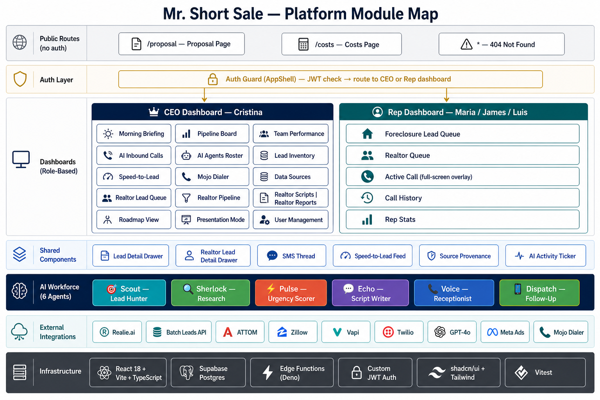

# Mr. Short Sale — Platform Modules

**Platform:** AI-powered foreclosure lead-generation & short-sale operations console  
**Stack:** React 18 + Vite + TypeScript · Supabase (Postgres + Edge Functions) · Tailwind + shadcn/ui

---

## Diagram



---

## Module Overview

The platform is divided into two role-scoped dashboards plus four cross-cutting layers.

```
┌────────────────────────────────────────────────────────────┐
│                     Mr. Short Sale Platform                │
├──────────────────────────┬─────────────────────────────────┤
│     CEO Dashboard        │       Rep Dashboard             │
│  (Cristina — owner)      │  (Maria / James / Luis)         │
├──────────────────────────┴─────────────────────────────────┤
│             AI Workforce Layer  (6 agents)                 │
├────────────────────────────────────────────────────────────┤
│             External Integrations Layer                    │
├────────────────────────────────────────────────────────────┤
│             Auth & User Management Layer                   │
└────────────────────────────────────────────────────────────┘
```

---

## 1. Authentication & User Management

**Purpose:** Controls who can access the platform and at what permission level.

### 1.1 Login / Sign-up
- **File:** `src/pages/LoginPage.tsx`, `src/services/auth.ts`, `src/contexts/AuthContext.tsx`
- Email + password form validated by Zod + React Hook Form
- POSTs to Supabase Edge Function `auth-login` / `auth-signup`
- JWT stored in `localStorage` as `mrs_token`
- Session restored on page load via `auth-me` Edge Function
- Demo quick-login cards for CEO and rep personas

### 1.2 User Management (CEO only)
- **File:** `src/components/ceo/UserManagement.tsx`
- List all platform users (name, email, role, active status)
- Create new reps or additional CEO accounts
- Update user details (name, email, password, role, avatar color)
- Soft-delete / deactivate users (cannot delete self)
- All CRUD via Edge Function `admin-users`; JWT role verified server-side

### 1.3 Auth Guard
- **File:** `src/App.tsx` (`AppShell`)
- `loading` → spinner
- No JWT or failed `auth-me` → `LoginPage`
- `role === 'ceo'` → `CEODashboard`
- `role === 'rep'` → `RepDashboard`

---

## 2. CEO Dashboard

### 2.1 Morning Briefing
- **File:** `src/components/ceo/MorningBriefing.tsx`
- Hero KPI tiles: leads pulled today, calls made, connections, pipeline value
- Animated counters, live-feel AI activity ticker
- Top-priority lead cards with urgency badges
- Entry point for the CEO's daily workflow

### 2.2 Short Sale Pipeline Board
- **File:** `src/components/ceo/PipelineBoard.tsx`
- Kanban board of active short-sale cases
- Four stages: `Initial Contact → Docs Collected → Bank Submitted → Pending Approval`
- Each card shows: homeowner, address, equity %, auction date, assigned rep
- Click → `CaseDetailDrawer.tsx` (case timeline, bank/attorney info, notes)

### 2.3 Team Performance
- **File:** `src/components/ceo/TeamPerformance.tsx`
- Per-rep KPI table: calls made, connections, pipeline cases, conversion rate
- Click on a rep → `AgentDrillDown.tsx`:
  - 7-day call trend (Recharts line chart)
  - Best connect-time heatmap
  - Connection rate by filing type (NOD / NTS / Lis Pendens)

### 2.4 AI Inbound Calls
- **File:** `src/components/ceo/AIInboundCalls.tsx`
- Feed of after-hours inbound calls handled by the Voice AI agent
- Per-call card: waveform visualization, EN/ES language tag, call duration
- Structured data extracted: homeowner name, address, mortgage status, intent
- Links to created lead or scheduled callback

### 2.5 AI Agents Roster
- **File:** `src/components/ceo/AIAgentsRoster.tsx`
- Six-agent grid with live status (active / working / idle)
- Per-agent: emoji, role, today's stats, last action + timestamp
- Click → `AgentActivityDrawer.tsx`: full description, tech stack, weekly impact, flow diagram

### 2.6 Data Sources
- **File:** `src/components/ceo/DataSources.tsx`
- Integration health cards: Realie.ai · Batch Leads API · ATTOM
- Last sync timestamp, records pulled, error rate
- Connection status indicators

### 2.7 Lead Inventory
- **File:** `src/components/ceo/LeadInventory.tsx`
- Full cross-rep lead table with filters (county, filing type, urgency, status)
- Bulk view of all 50 leads across the team
- Click → `LeadDetailDrawer.tsx` (shared with rep view)

### 2.8 Realtor Modules (CEO)
| Sub-module | File | Purpose |
|---|---|---|
| Realtor Lead Queue | `ceo/RealtorLeadQueue.tsx` | Kanban of listing-agent leads from Zillow |
| Realtor Pipeline | `ceo/RealtorPipeline.tsx` | Partner progression: New → Contacted → Partnered → Closed Won |
| Realtor Scripts | `ceo/RealtorScripts.tsx` | Pre-written realtor outreach scripts (EN/ES) |
| Realtor Reports | `ceo/RealtorReports.tsx` | Metrics on realtor channel performance |

### 2.9 Speed-to-Lead Screen
- **File:** `src/components/ceo/SpeedToLeadScreen.tsx`
- Real-time feed of newly ingested leads arriving in queue
- Elapsed time since filing surfaced; highlights leads not yet called

### 2.10 Mojo Dialer Screen
- **File:** `src/components/ceo/MojoDialerScreen.tsx`
- Integration view for Mojo Power Dialer (future: live dial stats, sessions)

### 2.11 Roadmap View
- **File:** `src/components/ceo/RoadmapView.tsx`
- Visual phase timeline: Phase 1 (Foundation) · Phase 2 (Communication) · Phase 3 (Intelligence)
- Status badges: Live in Demo · Planned · In Development

### 2.12 Presentation Mode
- **File:** `src/components/ceo/Presentation.tsx`
- Investor / partner sales-deck view
- Highlights platform value props, agent KPIs, ROI projections

---

## 3. Rep Dashboard

### 3.1 Foreclosure Lead Queue
- **File:** `src/components/rep/LeadQueue.tsx`
- Urgency-sorted list of assigned foreclosure leads
- Lead card: homeowner name, address, filing type badge, urgency score (1–10), equity %, days to auction
- Language badge (EN / ES), call status chip, ATTOM verification checkmark
- Compact `SpeedToLeadFeed` in sidebar
- Click → `LeadDetailDrawer.tsx`

### 3.2 Realtor Queue
- **File:** `src/components/rep/RealtorQueue.tsx`
- Listing-agent leads from Zillow assigned to this rep
- Shows: agent name, brokerage, property address, days on market, price drop history
- Status filter: New / Contacted / Partnered
- Click → `RealtorLeadDetailDrawer.tsx`

### 3.3 Active Call
- **File:** `src/components/rep/ActiveCall.tsx`
- Triggered when rep taps "Call" on a lead card
- Full-screen overlay with:
  - Bilingual AI-generated call script (auto-loaded)
  - Note-taking field
  - Call outcome selector (Connected / VM Left / Not Interested / Callback Scheduled)
  - SMS quick-send button
- State managed in `AppContext` via `activeCallLeadId`

### 3.4 Call History
- **File:** `src/components/rep/CallHistory.tsx`
- Chronological list of past calls for this rep
- Per-entry: lead name, date, duration, outcome, SMS thread link

### 3.5 Rep Stats
- **File:** `src/components/rep/RepStats.tsx`
- Personal KPI tiles: calls made, connection rate, callbacks pending, pipeline cases
- 7-day trend chart (Recharts)

---

## 4. Shared Components

| Component | File | Used By |
|---|---|---|
| Lead Detail Drawer | `shared/LeadDetailDrawer.tsx` | CEO (Lead Inventory) + Rep (Lead Queue) |
| Realtor Lead Detail Drawer | `shared/RealtorLeadDetailDrawer.tsx` | CEO (Realtor Lead Queue) + Rep (Realtor Queue) |
| SMS Thread | `shared/SMSThread.tsx` | Active Call + Call History |
| Speed-to-Lead Feed | `shared/SpeedToLeadFeed.tsx` | CEO (Speed-to-Lead Screen) + Rep (Lead Queue sidebar) |
| Source Provenance | `shared/SourceProvenance.tsx` | Lead Detail Drawer |
| AI Activity Ticker | `ceo/AIActivityTicker.tsx` | Morning Briefing |

---

## 5. AI Workforce (6 Agents)

| Agent | ID | Role | Stack | Trigger |
|---|---|---|---|---|
| Scout | `scout` | Lead Hunter | Realie.ai, Batch Leads API | Daily 6 AM cron |
| Sherlock | `sherlock` | Research Analyst | ATTOM, GPT-4o | On each new lead |
| Pulse | `pulse` | Urgency Scorer | GPT-4o | After Sherlock; re-scores on signal change |
| Echo | `echo` | Script Writer | GPT-4o | After Pulse; on lead open |
| Voice | `voice` | 24/7 Receptionist | Vapi, GPT-4o | On inbound call |
| Dispatch | `dispatch` | Follow-Up Bot | Twilio | On missed outbound call |

---

## 6. External Integrations

| Integration | File | Purpose |
|---|---|---|
| Realie.ai | `src/integrations/` + Scout | Primary foreclosure filing feed (NOD, NTS, Lis Pendens) |
| Batch Leads API | `src/integrations/batchLeads.ts` | Secondary filings + skip-trace contact data |
| ATTOM | `src/integrations/attom.ts` | Property valuation, mortgage balance, owner records |
| Zillow | `src/integrations/zillow.ts` | Listing-agent / short-sale keyword scrape |
| Meta Ads | `src/integrations/metaAds.ts` | Inbound homeowner lead source (future) |
| Mojo Dialer | `src/integrations/mojoDialer.ts` | Power dialing session data |
| Vapi | Voice agent stack | 24/7 inbound call answering + transcription |
| Twilio | Dispatch agent stack | Bilingual SMS delivery + reply tracking |
| GPT-4o | Sherlock · Pulse · Echo · Voice | AI reasoning, scoring, script generation |

---

## 7. Public / Marketing Pages

| Page | Route | Purpose |
|---|---|---|
| Proposal | `/proposal` | Client-facing proposal document (no auth required) |
| Costs | `/costs` | Pricing and ROI breakdown (no auth required) |
| 404 | `*` | Not found fallback |

---

## 8. Infrastructure

| Layer | Technology |
|---|---|
| Frontend hosting | Vite SPA (served via Lovable Cloud / CDN) |
| Database | Supabase Postgres (`public.users`; future: full domain tables) |
| API / BFF | Supabase Edge Functions (Deno runtime) |
| Auth | Custom JWT (HS256) via Edge Functions + `pgcrypto` bcrypt |
| Design system | shadcn/ui + Tailwind CSS v3 + HSL semantic tokens |
| Charts | Recharts |
| Testing | Vitest + Testing Library |
