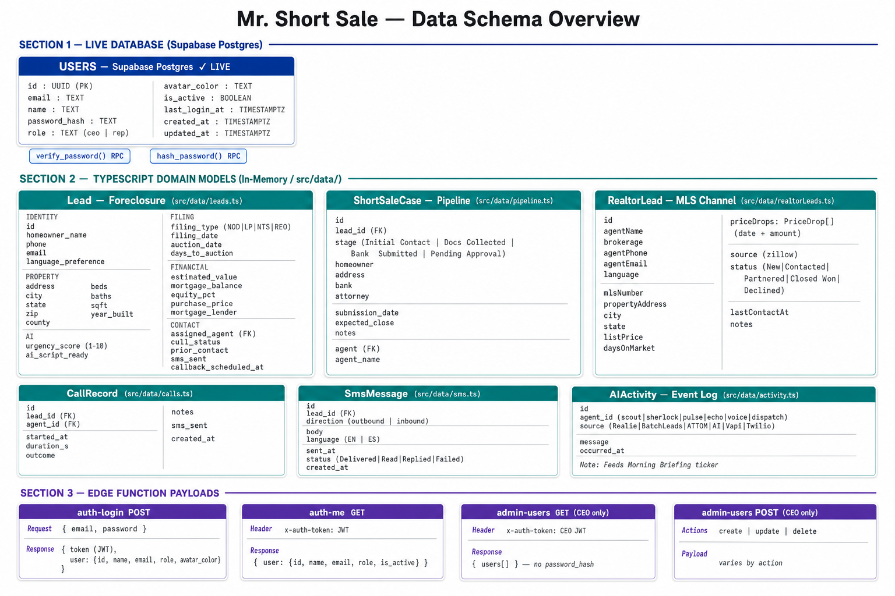

# Mr. Short Sale — Data Schemas

This document defines every data shape in the platform: the live Postgres tables, the in-memory domain models (TypeScript), and the planned production schemas.

---

## Diagram



---

## Part A — Live Database (Supabase Postgres)

### Table: `public.users`
> Migration: `supabase/migrations/001_create_users_table.sql`

```sql
CREATE TABLE public.users (
  id            UUID        PRIMARY KEY DEFAULT gen_random_uuid(),
  email         TEXT        NOT NULL,                        -- unique (case-insensitive index)
  name          TEXT        NOT NULL,
  password_hash TEXT        NOT NULL,                        -- bcrypt via pgcrypto
  role          TEXT        NOT NULL DEFAULT 'rep'
                            CHECK (role IN ('ceo', 'rep')),
  avatar_color  TEXT        NOT NULL DEFAULT '#185FA5',
  is_active     BOOLEAN     NOT NULL DEFAULT true,
  last_login_at TIMESTAMPTZ,
  created_at    TIMESTAMPTZ NOT NULL DEFAULT now(),
  updated_at    TIMESTAMPTZ NOT NULL DEFAULT now()           -- auto-updated by trigger
);

-- Unique constraint (case-insensitive)
CREATE UNIQUE INDEX users_email_lower_idx ON public.users (LOWER(email));

-- RLS: deny all direct access from anon/authenticated roles
-- Only service_role (Edge Functions) can read/write
```

**Stored Procedures:**
```sql
-- Hashes a plain password with bcrypt (bf cost 10)
verify_password(plain_password TEXT, stored_hash TEXT) RETURNS BOOLEAN

-- Returns bcrypt hash of a plain password
hash_password(plain_password TEXT) RETURNS TEXT
```

Both procedures are `SECURITY DEFINER` and executable by `service_role` only.

**Seed users** (`supabase/seed.sql`):

| Name | Email | Role | Password |
|---|---|---|---|
| Cristina Morales | cristina@mrshortsale.com | ceo | demo2026 |
| Maria Garcia | maria@mrshortsale.com | rep | demo2026 |
| James Williams | james@mrshortsale.com | rep | demo2026 |
| Luis Rodriguez | luis@mrshortsale.com | rep | demo2026 |

---

## Part B — TypeScript Domain Models (In-Memory / Seed Data)

These models live in `src/data/` and represent the full production schema once persisted.

---

### B.1 Lead (Foreclosure)
> File: `src/data/leads.ts`

```typescript
type FilingType  = 'NOD' | 'Lis Pendens' | 'NTS' | 'REO';
type CallStatus  = 'Not Called' | 'Called' | 'Connected' | 'Callback Scheduled'
                 | 'VM Left' | 'SMS Sent' | 'Not Interested' | 'In Progress';
type Language    = 'EN' | 'ES';

interface Lead {
  // Identity
  id:                    string;       // e.g. 'l1', 'lj1', 'll1'
  homeowner_name:        string;
  phone:                 string;
  email:                 string;
  language_preference:   Language;

  // Property
  address:               string;
  city:                  string;
  state:                 string;
  zip:                   string;
  county:                string;
  beds:                  number;
  baths:                 number;
  sqft:                  number;
  year_built:            number;

  // Foreclosure filing
  filing_type:           FilingType;
  filing_date:           string;       // ISO date
  auction_date:          string;       // ISO date
  days_to_auction:       number;

  // Financial
  estimated_value:       number;       // USD
  mortgage_balance:      number;       // USD
  equity_pct:            number;       // 0–100
  purchase_price:        number;
  purchase_date:         string;       // ISO date
  mortgage_lender:       string;

  // Data sourcing
  data_source_primary:   'Realie' | 'BatchLeads';
  attom_verified:        boolean;

  // AI scoring
  urgency_score:         number;       // 1–10
  ai_script_ready:       boolean;

  // Assignment & contact
  assigned_agent:        string;       // FK → users.id
  call_status:           CallStatus;
  prior_contact:         boolean;
  last_call_date:        string | null;
  last_call_outcome:     string | null;
  sms_sent:              boolean;
  sms_status:            string | null;
  callback_scheduled_at: string | null; // ISO datetime
}
```

---

### B.2 Short Sale Case (Pipeline)
> File: `src/data/pipeline.ts`

```typescript
type PipelineStage = 'Initial Contact' | 'Docs Collected' | 'Bank Submitted' | 'Pending Approval';

interface ShortSaleCase {
  id:              string;
  homeowner:       string;
  address:         string;
  stage:           PipelineStage;
  auction_date:    string;
  equity_pct:      number;
  agent:           string;       // FK → users.id
  agent_name:      string;
  bank:            string;       // mortgage servicer
  attorney:        string;
  submission_date: string | null; // date package sent to bank
  expected_close:  string | null; // projected approval date
  notes:           string;
}
```

**Stage progression:**
```
Initial Contact → Docs Collected → Bank Submitted → Pending Approval
```

---

### B.3 Realtor Lead
> File: `src/data/realtorLeads.ts`

```typescript
type RealtorLeadStatus = 'New' | 'Contacted' | 'Partnered' | 'Closed Won' | 'Declined';

interface PriceDrop {
  date:   string;   // ISO date
  amount: number;   // USD
}

interface RealtorLead {
  id:              string;
  // Listing agent contact
  agentName:       string;
  brokerage:       string;
  agentPhone:      string;
  agentEmail:      string;
  language:        'EN' | 'ES';
  // MLS / property
  mlsNumber:       string;
  propertyAddress: string;
  city:            string;
  state:           string;
  listPrice:       number;
  daysOnMarket:    number;
  priceDrops:      PriceDrop[];
  listingUrl:      string;       // Zillow URL
  source:          'zillow';
  // CRM
  status:          RealtorLeadStatus;
  lastContactAt:   string | null;
  notes?:          string;
}
```

**Hot lead rule:** `priceDrops.length >= 2 OR daysOnMarket >= 90`

---

### B.4 AI Agent
> File: `src/data/agents.ts`

```typescript
type AgentStatus = 'active' | 'working' | 'idle';

interface Agent {
  id:               string;       // 'scout' | 'sherlock' | 'pulse' | 'echo' | 'voice' | 'dispatch'
  name:             string;
  role:             string;
  emoji:            string;
  status:           AgentStatus;
  shortDescription: string;
  longDescription:  string[];
  stack:            string[];     // e.g. ['Realie.ai', 'BatchLeads']
  stats:            { label: string; value: string }[];
  lastAction:       string;
  lastActionTime:   string;
  weeklyImpact:     { hoursSaved: string; actions: string; accuracy: string };
  flow:             string;       // human-readable pipeline description
  activitySources:  string[];     // matches AIActivity.source
}
```

---

### B.5 Call Record
> File: `src/data/calls.ts`

```typescript
interface CallRecord {
  id:         string;
  lead_id:    string;       // FK → Lead.id
  agent_id:   string;       // FK → users.id
  date:       string;       // ISO datetime
  duration:   number;       // seconds
  outcome:    CallStatus;
  notes:      string;
  sms_sent:   boolean;
}
```

---

### B.6 SMS Message
> File: `src/data/sms.ts`

```typescript
type SmsDirection = 'outbound' | 'inbound';
type SmsStatus    = 'Delivered' | 'Read' | 'Replied' | 'Failed';

interface SmsMessage {
  id:        string;
  lead_id:   string;       // FK → Lead.id
  direction: SmsDirection;
  body:      string;
  language:  'EN' | 'ES';
  sent_at:   string;       // ISO datetime
  status:    SmsStatus;
}
```

---

### B.7 AI Activity Event
> File: `src/data/activity.ts`

```typescript
type ActivitySource = 'Realie' | 'BatchLeads' | 'ATTOM' | 'AI' | 'Vapi' | 'Twilio';

interface AIActivity {
  id:        string;
  source:    ActivitySource;
  message:   string;
  timestamp: string;
  agentId:   string;       // FK → Agent.id
}
```

**Urgency reason generator:**
```typescript
getUrgencyReason(lead: Lead): string
// Returns plain-English explanation, e.g.:
// "9/10: 28 days to auction, 11% equity, never contacted"
```

---

### B.8 Case Detail
> File: `src/data/caseDetails.ts`

Extended view of a ShortSaleCase including timeline milestones and document checklist, rendered in `CaseDetailDrawer.tsx`.

---

### B.9 Inventory Lead (CEO view)
> File: `src/data/inventoryLeads.ts`

Aggregated lead view for the CEO Lead Inventory screen. Extends `Lead` with cross-rep assignment metadata.

---

## Part C — Edge Function Payloads

### `auth-login` POST
```typescript
// Request
{ email: string; password: string }

// Response (success)
{ token: string; user: { id, name, email, role, avatar_color } }

// Response (error)
{ error: string }
```

### `auth-signup` POST
```typescript
// Request
{ name: string; email: string; password: string }

// Response (success)
{ token: string; user: { id, name, email, role, avatar_color } }
```

### `auth-me` GET
```typescript
// Header: x-auth-token: <jwt>
// Response (success)
{ user: { id, name, email, role, avatar_color, is_active } }
```

### `admin-users` GET (CEO only)
```typescript
// Header: x-auth-token: <jwt>  (must decode to role=ceo)
// Response
{ users: User[] }    // password_hash excluded
```

### `admin-users` POST (CEO only)
```typescript
// Request — create
{ action: 'create'; name: string; email: string; password: string; role: 'ceo'|'rep'; avatar_color?: string }

// Request — update
{ action: 'update'; id: string; name?: string; email?: string; password?: string; role?: string; is_active?: boolean; avatar_color?: string }

// Request — delete
{ action: 'delete'; id: string }
```

---

## Part D — Planned Production Tables

When the platform moves to a full backend, the following tables should be created (no migrations exist yet):

```sql
-- Foreclosure leads (persistent)
CREATE TABLE leads (
  id                    UUID PRIMARY KEY DEFAULT gen_random_uuid(),
  homeowner_name        TEXT NOT NULL,
  phone                 TEXT,
  email                 TEXT,
  language_preference   TEXT DEFAULT 'EN',
  address               TEXT NOT NULL,
  city                  TEXT,
  state                 TEXT,
  zip                   TEXT,
  county                TEXT,
  filing_type           TEXT NOT NULL,   -- NOD | Lis Pendens | NTS | REO
  filing_date           DATE,
  auction_date          DATE,
  days_to_auction       INTEGER,
  estimated_value       NUMERIC,
  mortgage_balance      NUMERIC,
  equity_pct            NUMERIC,
  purchase_price        NUMERIC,
  purchase_date         DATE,
  mortgage_lender       TEXT,
  data_source_primary   TEXT,            -- Realie | BatchLeads
  attom_verified        BOOLEAN DEFAULT false,
  urgency_score         SMALLINT,        -- 1–10
  ai_script_ready       BOOLEAN DEFAULT false,
  assigned_agent        UUID REFERENCES users(id),
  call_status           TEXT DEFAULT 'Not Called',
  prior_contact         BOOLEAN DEFAULT false,
  last_call_date        TIMESTAMPTZ,
  last_call_outcome     TEXT,
  sms_sent              BOOLEAN DEFAULT false,
  sms_status            TEXT,
  callback_scheduled_at TIMESTAMPTZ,
  beds                  SMALLINT,
  baths                 NUMERIC,
  sqft                  INTEGER,
  year_built            SMALLINT,
  created_at            TIMESTAMPTZ DEFAULT now(),
  updated_at            TIMESTAMPTZ DEFAULT now()
);

-- Short sale pipeline cases
CREATE TABLE short_sale_cases (
  id              UUID PRIMARY KEY DEFAULT gen_random_uuid(),
  lead_id         UUID REFERENCES leads(id),
  stage           TEXT NOT NULL DEFAULT 'Initial Contact',
  bank            TEXT,
  attorney        TEXT,
  submission_date DATE,
  expected_close  DATE,
  notes           TEXT,
  created_at      TIMESTAMPTZ DEFAULT now(),
  updated_at      TIMESTAMPTZ DEFAULT now()
);

-- Realtor / listing-agent leads
CREATE TABLE realtor_leads (
  id               UUID PRIMARY KEY DEFAULT gen_random_uuid(),
  agent_name       TEXT NOT NULL,
  brokerage        TEXT,
  agent_phone      TEXT,
  agent_email      TEXT,
  language         TEXT DEFAULT 'EN',
  mls_number       TEXT,
  property_address TEXT,
  city             TEXT,
  state            TEXT,
  list_price       NUMERIC,
  days_on_market   INTEGER,
  listing_url      TEXT,
  source           TEXT DEFAULT 'zillow',
  status           TEXT DEFAULT 'New',
  last_contact_at  TIMESTAMPTZ,
  notes            TEXT,
  created_at       TIMESTAMPTZ DEFAULT now(),
  updated_at       TIMESTAMPTZ DEFAULT now()
);

-- Price drop history for realtor leads
CREATE TABLE realtor_price_drops (
  id               UUID PRIMARY KEY DEFAULT gen_random_uuid(),
  realtor_lead_id  UUID REFERENCES realtor_leads(id) ON DELETE CASCADE,
  drop_date        DATE NOT NULL,
  amount           NUMERIC NOT NULL
);

-- Call records
CREATE TABLE calls (
  id          UUID PRIMARY KEY DEFAULT gen_random_uuid(),
  lead_id     UUID REFERENCES leads(id),
  agent_id    UUID REFERENCES users(id),
  started_at  TIMESTAMPTZ NOT NULL,
  duration_s  INTEGER,
  outcome     TEXT,
  notes       TEXT,
  sms_sent    BOOLEAN DEFAULT false,
  created_at  TIMESTAMPTZ DEFAULT now()
);

-- SMS messages
CREATE TABLE sms_messages (
  id         UUID PRIMARY KEY DEFAULT gen_random_uuid(),
  lead_id    UUID REFERENCES leads(id),
  direction  TEXT NOT NULL,   -- outbound | inbound
  body       TEXT NOT NULL,
  language   TEXT DEFAULT 'EN',
  sent_at    TIMESTAMPTZ NOT NULL,
  status     TEXT,            -- Delivered | Read | Replied | Failed
  created_at TIMESTAMPTZ DEFAULT now()
);

-- AI activity log
CREATE TABLE ai_activity (
  id         UUID PRIMARY KEY DEFAULT gen_random_uuid(),
  agent_id   TEXT NOT NULL,   -- scout | sherlock | pulse | echo | voice | dispatch
  source     TEXT NOT NULL,   -- Realie | BatchLeads | ATTOM | AI | Vapi | Twilio
  message    TEXT NOT NULL,
  occurred_at TIMESTAMPTZ DEFAULT now()
);
```
