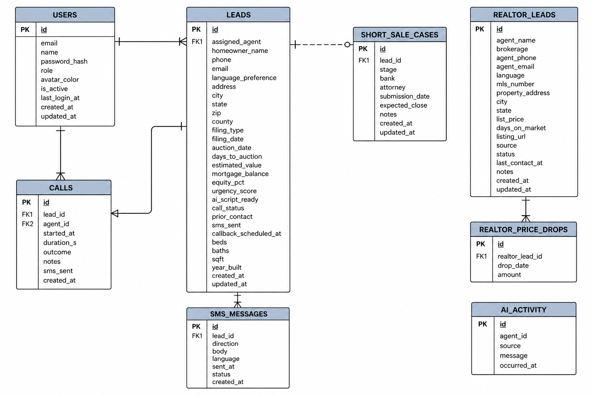
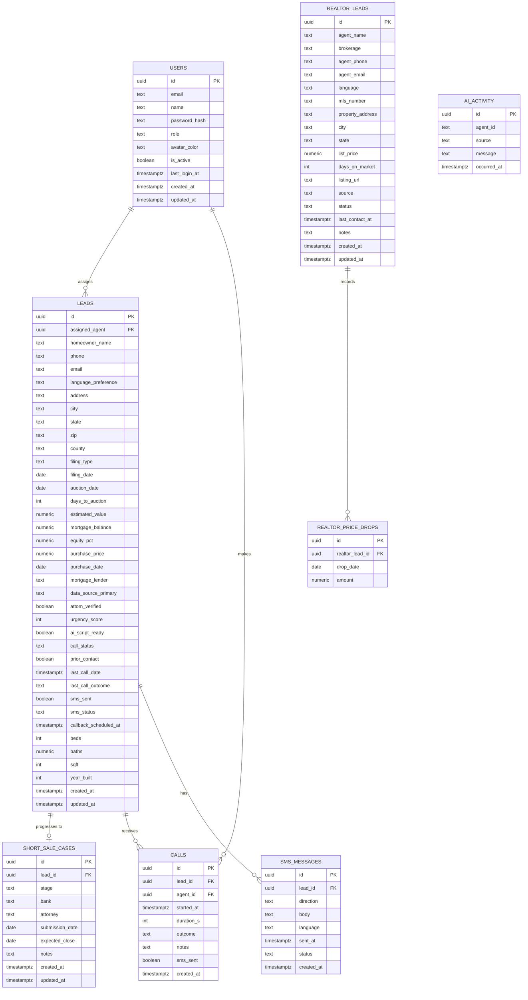

# Mr. Short Sale — Entity Relationship Diagram

> **Live today:** `USERS` table only (Supabase Postgres).  
> All other entities are in-memory TypeScript and will become database tables in the production build.

---

## Diagram

---

## Mermaid Source

---

## Relationship Summary

| Relationship | Cardinality | Description |
|---|---|---|
| `USERS` → `LEADS` | 1 : many | A rep is assigned many leads |
| `USERS` → `CALLS` | 1 : many | A rep makes many calls |
| `LEADS` → `SHORT_SALE_CASES` | 1 : 0-or-1 | A qualified lead can progress into a pipeline case |
| `LEADS` → `CALLS` | 1 : many | A lead can receive many call attempts |
| `LEADS` → `SMS_MESSAGES` | 1 : many | A lead can receive/send many SMS messages |
| `REALTOR_LEADS` → `REALTOR_PRICE_DROPS` | 1 : many | A realtor listing can have multiple price reductions |
| `AI_ACTIVITY` | standalone | Event log; references `agent_id` as a text key (not FK) |

---

## Entity Descriptions

### USERS
Platform users. Two roles: `ceo` (full access) and `rep` (restricted to their own leads and queues). Authentication is custom — no dependency on Supabase Auth.

### LEADS
Core entity. Represents a homeowner in foreclosure distress. Created by the Scout AI agent from Realie.ai / Batch Leads API, enriched by Sherlock (ATTOM), scored by Pulse, scripted by Echo, and then worked by a rep.

### SHORT_SALE_CASES
A lead that has advanced past initial contact. Tracks the short-sale negotiation with the bank through four stages: Initial Contact → Docs Collected → Bank Submitted → Pending Approval.

### REALTOR_LEADS
A separate lead channel — listing agents found on Zillow who have active short-sale listings. Mr. Short Sale pitches co-processing partnerships to these agents. Different workflow from foreclosure leads.

### REALTOR_PRICE_DROPS
Records each time a listing agent reduces their list price. Two or more price drops is a "hot" signal indicating the agent is motivated.

### CALLS
Every outbound call attempt from a rep to a homeowner. Linked to both the lead and the rep. Captures outcome, duration, and notes.

### SMS_MESSAGES
Inbound and outbound SMS between the platform and homeowners. Outbound messages are sent by the Dispatch AI agent on missed calls. Inbound replies are flagged for the assigned rep.

### AI_ACTIVITY
Event log of everything the 6 AI agents do. Feeds the Morning Briefing activity ticker and the AI Agents Roster "last action" display. `agent_id` is a text identifier (`scout`, `sherlock`, etc.), not a foreign key to a DB table.

---

## Key Business Rules Reflected in the Model

1. **Equity rule:** A `LEAD` is a short-sale candidate only when `equity_pct <= 25`. Leads above this threshold are filtered out by Scout.
2. **Urgency scoring:** `urgency_score` (1–10) is computed by Pulse from `days_to_auction`, `equity_pct`, and `prior_contact`. Higher = call sooner.
3. **One case per lead:** A `LEAD` maps to at most one `SHORT_SALE_CASE`. Multiple cases per homeowner would require a new lead record.
4. **Language routing:** `language_preference` on `LEADS` and `language` on `REALTOR_LEADS` controls whether Echo generates an English or Spanish script, and whether Voice/Dispatch communicates in EN or ES.
5. **Realtor "hot" signal:** `REALTOR_LEADS` is hot when `priceDrops.length >= 2 OR daysOnMarket >= 90`. No schema change needed — derived at query time.
