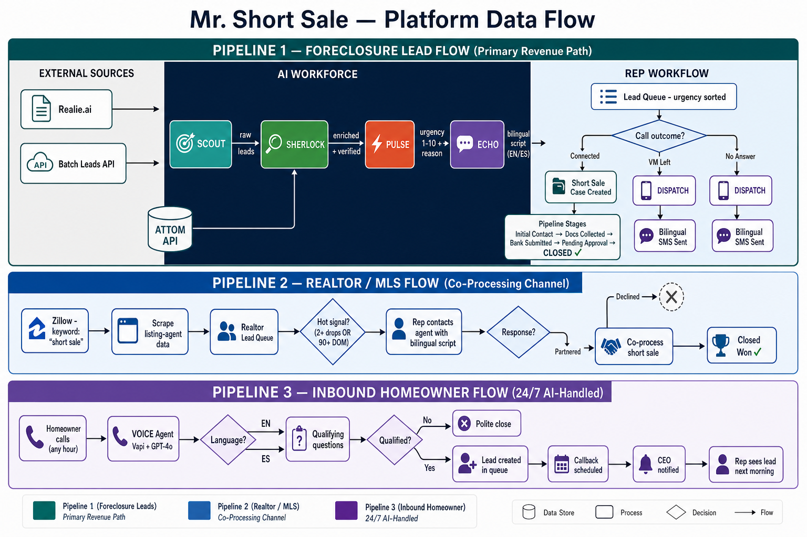

# Mr. Short Sale — Platform Data Flow

This document describes how data moves through the system — from external sources, through AI agents, into the rep's queue, and through to a closed short-sale case.

---

## Diagram



---

## Overview: Three Parallel Pipelines

```
┌─────────────────────────────────────────────────────────────────────┐
│                         MR. SHORT SALE                              │
│                                                                     │
│  ┌──────────────────────────────────────┐                          │
│  │  PIPELINE 1: Foreclosure Lead Flow   │  (primary revenue path)  │
│  └──────────────────────────────────────┘                          │
│                                                                     │
│  ┌──────────────────────────────────────┐                          │
│  │  PIPELINE 2: Realtor / MLS Flow      │  (co-processing channel) │
│  └──────────────────────────────────────┘                          │
│                                                                     │
│  ┌──────────────────────────────────────┐                          │
│  │  PIPELINE 3: Inbound Homeowner Flow  │  (reactive / 24/7)       │
│  └──────────────────────────────────────┘                          │
└─────────────────────────────────────────────────────────────────────┘
```

---

## Pipeline 1: Foreclosure Lead Flow

### Step-by-step data journey

```
[External Sources]                [AI Agents]                [Platform]               [Outcome]
       │                               │                          │                        │
  Realie.ai ──────┐                    │                          │                        │
  Batch Leads ────┼──► SCOUT ──────────► Lead Queue (raw)         │                        │
                  │   (6 AM daily)     │    │                     │                        │
                  │                    │    ▼                     │                        │
            ATTOM ◄──────────── SHERLOCK ───► Lead enriched       │                        │
            (property        (verify & enrich)  (equity, property  │                        │
             data API)             │            data added)        │                        │
                                   │    │                          │                        │
                                   │    ▼                          │                        │
                               PULSE ──► urgency_score 1-10       │                        │
                            (scorer)        │  + reason text       │                        │
                                            │                      │                        │
                                            ▼                      │                        │
                                       ECHO ──► ai_script_ready    │                        │
                                    (script)    + EN/ES script     │                        │
                                                │                  │                        │
                                                ▼                  │                        │
                                     ┌──────────────────────┐      │                        │
                                     │  REP LEAD QUEUE      │      │                        │
                                     │  (urgency sorted)    │      │                        │
                                     └──────────────────────┘      │                        │
                                                │                  │                        │
                              ┌─────────────────┼─────────────────┐│                        │
                              │                 │                  ││                        │
                              ▼                 ▼                  ▼│                        │
                         Rep calls        VM left →            No answer →                  │
                         homeowner        SMS sent             DISPATCH                      │
                              │           (auto)               sends SMS                    │
                              │               │                    │                        │
                    ┌─────────┴──┐            └────────────────────┘                        │
                    │            │                                                           │
                    ▼            ▼                                                           │
               Connected    Not Interested                                                   │
                    │                                                                        │
                    ▼                                                                        │
           SHORT SALE CASE                                                                   │
           created in pipeline                                                               │
                    │                                                                        │
        ┌───────────┼───────────────────┐                                                   │
        ▼           ▼                   ▼                                                   │
  Initial      Docs Collected    Bank Submitted                                              │
  Contact                                │                                                  │
                                         ▼                                                  │
                                   Pending Approval                                         │
                                         │                                                  │
                                         ▼                                                  │
                                    CLOSED ────────────────────────────────────────────►   ✓
```

### Detailed steps

| Step | Actor | Input | Output | Notes |
|---|---|---|---|---|
| 1. Ingest | Scout (Realie.ai + Batch Leads) | Raw filing feeds | New lead records | 6 AM daily; de-dupes by address + APN |
| 2. Filter | Scout | All new leads | Filtered leads | equity_pct ≤ 25%, target ZIPs only |
| 3. Enrich | Sherlock (ATTOM) | Lead address | Property data | beds/baths/sqft/valuation/lender added |
| 4. Verify | Sherlock | Realie + ATTOM data | `attom_verified = true` | Flags discrepancies between sources |
| 5. Score | Pulse | days_to_auction + equity_pct + prior_contact | `urgency_score` 1–10 + reason string | Re-scores when signals change |
| 6. Script | Echo (GPT-4o) | Lead data + language preference | Bilingual call script | EN or ES based on `language_preference` |
| 7. Queue | Platform | Scored + scripted leads | Rep lead queue | Sorted highest urgency first |
| 8. Call | Rep | Lead card + script | Call outcome logged | `call_status` updated |
| 9. SMS | Dispatch (Twilio) | Missed call event | Bilingual SMS sent | Auto-triggers; delivery tracked |
| 10. Case | Rep / CEO | Interested homeowner | ShortSaleCase created | Moves to pipeline board |
| 11. Pipeline | CEO + attorney | Case + documents | Stage progression | Initial Contact → Approval |

---

## Pipeline 2: Realtor / MLS Flow

```
  Zillow (keyword: "short sale")
         │
         ▼
  Scrape listing-agent contact data
  (agent name, brokerage, phone, email, MLS#, price drops, days on market)
         │
         ▼
  Realtor Lead Queue (status: New)
         │
    ┌────┴────────────────────────────┐
    │  Hot signal detection           │
    │  - 2+ price drops               │
    │  - 90+ days on market           │
    └────┬────────────────────────────┘
         │
         ▼
  Rep contacts listing agent
  (phone + bilingual script from Realtor Scripts module)
         │
    ┌────┴──────────────────────────┐
    │                               │
    ▼                               ▼
  Declined                     Partnered
                                    │
                                    ▼
                           Co-list or co-process
                           the short sale
                                    │
                                    ▼
                               Closed Won
```

---

## Pipeline 3: Inbound Homeowner Flow (24/7)

```
  Homeowner calls Mr. Short Sale phone number
          │
          ▼ (any hour, any day)
    VOICE agent (Vapi + GPT-4o)
          │
    ┌─────┴──────────────────────────┐
    │  Language detection (EN / ES)  │
    └─────┬──────────────────────────┘
          │
          ▼
    Qualifying questions:
    - Property address?
    - Are you the owner?
    - Facing foreclosure?
    - Mortgage status?
          │
    ┌─────┴──────────────────────────┐
    │                                │
    ▼                                ▼
  Not qualified                 Qualified
  (polite close)                     │
                                     ▼
                          Lead record created
                          in foreclosure queue
                          (urgency scored + scripted)
                                     │
                                     ▼
                          Callback scheduled
                          for human rep
                                     │
                                     ▼
                          CEO notified in
                          AI Inbound Calls screen
```

---

## Auth / Session Data Flow

```
Browser                  Supabase Edge Functions           Supabase Postgres
   │                              │                               │
   │── POST /auth-login ─────────►│                               │
   │   { email, password }        │── SELECT user WHERE email ───►│
   │                              │◄── user row ──────────────────│
   │                              │── rpc('verify_password') ────►│
   │                              │◄── true / false ──────────────│
   │                              │── UPDATE last_login_at ───────►│
   │◄── { token, user } ─────────│                               │
   │                              │                               │
   │ store token in localStorage  │                               │
   │                              │                               │
   │── GET /auth-me ─────────────►│                               │
   │   x-auth-token: <jwt>        │── verify JWT signature        │
   │                              │── SELECT user WHERE id ──────►│
   │◄── { user } ────────────────│◄── user row ──────────────────│
   │                              │                               │
   │ render CEO or Rep dashboard  │                               │
```

**JWT payload:**
```json
{
  "sub":   "<user uuid>",
  "email": "cristina@mrshortsale.com",
  "role":  "ceo",
  "iat":   1746000000,
  "exp":   1746086400
}
```

---

## CEO Admin Data Flow

```
CEO (browser)              Edge Function: admin-users       Supabase Postgres
     │                              │                               │
     │── GET /admin-users ─────────►│                               │
     │   x-auth-token: <ceo jwt>    │── verify JWT (role=ceo)      │
     │                              │── DB check: user is active ──►│
     │                              │── SELECT * FROM users ────────►│
     │◄── { users[] } ─────────────│◄── rows ──────────────────────│
     │                              │                               │
     │── POST /admin-users ────────►│                               │
     │   { action: 'create', ... }  │── hash_password RPC ─────────►│
     │                              │── INSERT INTO users ──────────►│
     │◄── { user } ────────────────│◄── new row ───────────────────│
```

---

## AI Agent Data Flow (Detailed)

```
                    ┌─────────────────────────────────────────────────┐
                    │               AI WORKFORCE                      │
                    │                                                 │
  Realie.ai ────────► SCOUT ──────────────────────────────────────┐  │
  Batch Leads ──────►        (dedup + ZIP filter)                 │  │
                    │                                             │  │
  ATTOM ────────────► SHERLOCK ◄──────────────────────────────────┘  │
                    │          (enrich: equity, property, lender)    │
                    │                    │                           │
  GPT-4o ───────────► PULSE ◄────────────┘                          │
                    │        (score 1-10, generate reason)          │
                    │                    │                           │
  GPT-4o ───────────► ECHO  ◄────────────┘                          │
                    │        (generate bilingual call script)       │
                    │                    │                           │
                    │                    ▼                           │
                    │             Lead in queue                      │
                    │             (scored + scripted)                │
                    │                                                 │
  Vapi + GPT-4o ───► VOICE  ──► AI Inbound Calls screen             │
                    │             + new lead if qualified            │
                    │                                                 │
  Twilio ───────────► DISPATCH ──► SMS sent to homeowner             │
                    │               + delivery tracked               │
                    └─────────────────────────────────────────────────┘
                                         │
                                         ▼
                               AI Activity Log
                               (feeds Morning Briefing ticker)
```

---

## Real-Time / Simulation Layer

In the current prototype, "live feel" is simulated client-side:

```
useLiveSimulation (hook)
         │
         ├── setInterval every 8–15 seconds
         │         │
         │         └── picks a random activity from incomingLeadSamples[]
         │                   │
         │                   └── fires a Sonner toast notification
         │                         (e.g. "Scout pulled 3 new NOD filings")
         │
         └── AI Activity Ticker updates its feed in MorningBriefing
```

In production, this would be replaced by:
- Supabase Realtime subscriptions on `ai_activity` table
- Server-sent events from Edge Functions on lead ingestion
- WebSocket from Vapi for live call transcripts

---

## Data Source Health Monitoring

```
CEO (DataSources screen)
         │
         ▼
  Integration health cards:
  ┌─────────────────────────────────┐
  │ Realie.ai    ● Connected        │
  │ Last sync: today 6:00 AM        │
  │ Records pulled: 47              │
  ├─────────────────────────────────┤
  │ Batch Leads  ● Connected        │
  │ Last sync: today 6:01 AM        │
  │ Records pulled: 12              │
  ├─────────────────────────────────┤
  │ ATTOM        ● Connected        │
  │ Last sync: continuous           │
  │ Verifications today: 47         │
  └─────────────────────────────────┘
```

In production, each card would poll an Edge Function that calls the respective API's health endpoint and returns a status + last-sync timestamp.

---

## Summary: Who Produces and Who Consumes Each Data Entity

| Entity | Produced By | Consumed By |
|---|---|---|
| Lead | Scout (from Realie / Batch Leads) | Sherlock → Pulse → Echo → Rep Lead Queue → CEO Lead Inventory |
| Property enrichment | Sherlock (ATTOM) | Lead card, Lead Detail Drawer, Script |
| Urgency score | Pulse (GPT-4o) | Lead queue sort order, Morning Briefing, CEO Pipeline |
| Call script | Echo (GPT-4o) | Rep Active Call screen, Lead Detail Drawer |
| Short sale case | Rep / CEO (on connection) | CEO Pipeline Board, CaseDetailDrawer |
| Realtor lead | Zillow scrape | Realtor Queue (CEO + Rep), Realtor Pipeline |
| Call record | Rep (on call outcome) | Call History, Rep Stats, Team Performance |
| SMS message | Dispatch (Twilio) + Rep | SMS Thread, Call History |
| AI activity event | All 6 agents | Morning Briefing ticker, AI Agents Roster |
| Inbound call transcript | Voice (Vapi) | AI Inbound Calls screen, new Lead creation |
| User record | CEO (admin-users) + sign-up | All role-gated screens, lead assignment |
