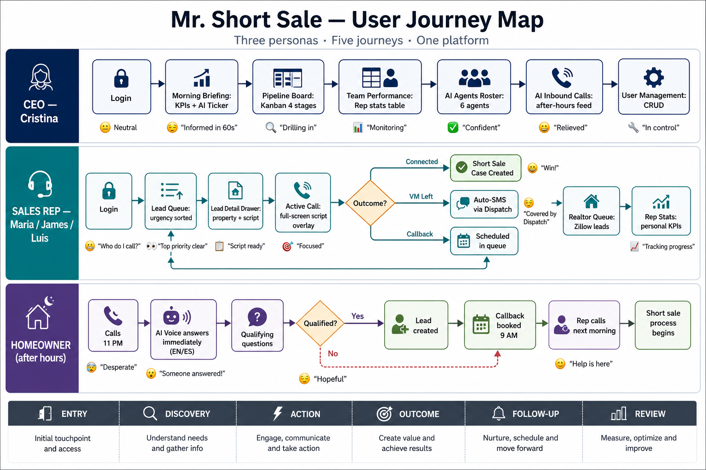

# Mr. Short Sale — User Journey Map

This document maps the complete journey of every user type through the platform — from first login to closed deal.

---

## Diagram



---

## User Personas

| Persona | Name | Role | Goal | Pain Points (pre-platform) |
|---|---|---|---|---|
| **CEO / Owner** | Cristina | `ceo` | See the full pipeline, track team performance, prove ROI | Fragmented spreadsheets, no visibility on rep activity, missed after-hours calls |
| **Sales Rep A** | Maria | `rep` | Call the right leads first with a script ready | Manual research, no prioritization, bilingual prep time |
| **Sales Rep B** | James | `rep` | Move leads through the pipeline efficiently | Same as Maria |
| **Sales Rep C** | Luis | `rep` | Close Spanish-speaking homeowners | Language barrier, no bilingual tools |

---

## Journey 1: CEO — Daily Operations

### Phase 1: Start of Day

```
CEO opens app (any device)
         │
         ▼
  ┌──────────────────┐
  │  LoginPage       │
  │  Email + PW      │◄── Quick demo card (one-click login)
  └──────────┬───────┘
             │  POST /auth-login → JWT stored
             ▼
  ┌──────────────────────────────────────────────┐
  │  CEO Dashboard loads                         │
  │  Default view: MORNING BRIEFING              │
  └──────────────────────────────────────────────┘
             │
             ▼
  Morning Briefing screen
  ┌─────────────────────────────────────────────┐
  │  KPI tiles:                                 │
  │  • 47 leads pulled today (Scout)            │
  │  • 12 calls made                            │
  │  • 4 connections                            │
  │  • $3.2M pipeline value                     │
  │                                             │
  │  AI Activity Ticker:                        │
  │  "Scout pulled 3 NOD filings (Westchester)" │
  │  "Pulse re-scored 12 leads"                 │
  │  "Dispatch sent 14 SMS today"               │
  │                                             │
  │  Top 3 priority leads (urgency 9-10):       │
  │  • Patricia Lopez — NTS — 28 days — 8% eq   │
  │  • James Tran — NOD — 41 days — 18% eq      │
  └─────────────────────────────────────────────┘
```

**CEO emotion:** Informed and in control within 60 seconds of login.

---

### Phase 2: Pipeline Review

```
CEO clicks "Active Pipeline" in sidebar
         │
         ▼
  Pipeline Board (Kanban)
  ┌────────────────────────────────────────────────────────────┐
  │ Initial Contact (6) │ Docs Collected (3) │ Bank Submitted (3) │ Pending Approval (1) │
  │                     │                    │                   │                      │
  │ James Tran          │ Angela Rivera      │ Carlos Mendez     │ Diana Huang          │
  │ Maria Santos        │ Thomas Walsh       │ Linda Foster      │                      │
  │ Robert Chen         │ Susan Park         │ Kevin O'Brien     │                      │
  └────────────────────────────────────────────────────────────┘
             │
             ▼
  CEO clicks on "Diana Huang" (Pending Approval)
             │
             ▼
  CaseDetailDrawer opens:
  • Homeowner: Diana Huang, Harrison NY
  • Bank: Quicken Loans
  • Attorney: Huang Legal
  • Submitted: Mar 15, 2026
  • Expected close: May 15, 2026
  • Notes: "Final approval expected this week. Investor sign-off pending."
  • Timeline milestones shown
```

---

### Phase 3: Team Performance Check

```
CEO clicks "Team Performance" in sidebar
         │
         ▼
  Team Performance table:
  ┌────────────────────────────────────────────────────┐
  │ Rep    │ Calls │ Connections │ Rate │ Cases │       │
  │ Maria  │  15   │      6      │  40% │   4   │ [→]  │
  │ James  │  18   │      5      │  28% │   4   │ [→]  │
  │ Luis   │  17   │      7      │  41% │   4   │ [→]  │
  └────────────────────────────────────────────────────┘
             │
  CEO clicks [→] on Maria
             │
             ▼
  AgentDrillDown drawer:
  • 7-day call trend chart (Recharts)
  • Best connect time: Tuesdays 2–4 PM
  • Connection rate by filing type:
    - NOD: 45%
    - NTS: 38%
    - Lis Pendens: 32%
```

---

### Phase 4: AI Agents Overview

```
CEO clicks "AI Agents" in sidebar
         │
         ▼
  AIAgentsRoster — 6 agent cards:
  ┌───────────────────────────────────┐
  │ 🎯 Scout   [● Active]             │
  │ Pulled 47 leads today             │
  │ Last: "3 new NOD filings" (now)   │
  └───────────────────────────────────┘
             │
  CEO clicks on Scout card
             │
             ▼
  AgentActivityDrawer:
  • Full description of what Scout does
  • Tech stack: Realie.ai + Batch Leads API
  • Weekly impact: 6.4 hrs saved · 312 actions · 100% accuracy
  • Flow: "Realie.ai + Batch Leads → Scout → Lead Queue"
```

---

### Phase 5: Reviewing AI Inbound Calls

```
CEO clicks "AI Inbound" in sidebar
         │
         ▼
  AI Inbound Calls feed:
  ┌─────────────────────────────────────────────┐
  │ Call #1 — 2:14 AM — 3m 42s — [ES]           │
  │ "Hola, mi nombre es Patricia Lopez..."       │
  │ Extracted: Address · Owner confirmed ·       │
  │ Foreclosure confirmed · Callback 9 AM        │
  │ → Lead created: Patricia Lopez (Urgency 9)  │
  └─────────────────────────────────────────────┘
```

---

### Phase 6: User Management

```
CEO clicks "User Management" in Admin section
         │
         ▼
  User list:
  • Cristina (ceo) [active]
  • Maria (rep) [active]
  • James (rep) [active]
  • Luis (rep) [active]
             │
  CEO clicks "+ Add User"
             │
             ▼
  Create user form:
  • Name, Email, Password, Role (ceo/rep)
  → POST /admin-users { action: 'create' }
  → New rep added, appears in list immediately
```

---

## Journey 2: Sales Rep — Daily Lead Working

### Phase 1: Login

```
Rep opens app
         │
         ▼
  LoginPage
  • Email + password
  • OR one-click demo card (James / Maria / Luis)
         │
         ▼
  POST /auth-login → JWT → RepDashboard
```

---

### Phase 2: Check Lead Queue

```
Rep Dashboard loads
Default view: Foreclosure Lead Queue
         │
         ▼
  Lead Queue (urgency sorted)
  ┌────────────────────────────────────────────────────────────┐
  │ #1  Patricia Lopez  NTS  Bronxville NY  [9] 28d  8% eq  ES │
  │ #2  James Tran      NOD  White Plains   [8] 41d  18% eq EN │
  │ #3  Robert Chen     NOD  Tarrytown NY   [7] 67d  11% eq EN │
  │ #4  Maria Santos    LP   Yonkers NY     [7] 55d  22% eq ES │
  └────────────────────────────────────────────────────────────┘
  SpeedToLeadFeed in sidebar: "2 new leads in last hour"
```

---

### Phase 3: Inspect a Lead

```
Rep clicks on Patricia Lopez (top priority)
         │
         ▼
  LeadDetailDrawer:
  ┌───────────────────────────────────────────────────────────┐
  │ PATRICIA LOPEZ                     [Urgency: 9 / 10]     │
  │ 5 River Rd, Bronxville NY 10708                           │
  │ NTS filed Apr 8, 2026 · Auction: May 7 (28 days)         │
  │                                                           │
  │ Property: 4bed/3bath · 2,400 sqft · Built 1985           │
  │ Value: $620,000 · Mortgage: $570,400 · Equity: 8%        │
  │ Lender: Wells Fargo                                       │
  │                                                           │
  │ Source: Realie ✓ · ATTOM verified ✓                      │
  │                                                           │
  │ Language: EN · Phone: (914) 555-0102                     │
  │                                                           │
  │ Urgency reason:                                           │
  │ "9/10: 28 days to auction, 11% equity, never contacted"  │
  │                                                           │
  │ AI Script: [View Script]                                  │
  │ Prior contact: None                                       │
  │                                                           │
  │ [📞 Call Now]  [💬 Send SMS]  [📋 View Script]            │
  └───────────────────────────────────────────────────────────┘
```

---

### Phase 4: Make a Call

```
Rep clicks [📞 Call Now] on Patricia Lopez
         │
         ▼
  ActiveCall overlay loads (full screen)
  ┌────────────────────────────────────────────────────────────┐
  │ CALLING: Patricia Lopez                                    │
  │ (914) 555-0102                                             │
  │                                                            │
  │ AI SCRIPT (English):                                       │
  │ "Hi Patricia, my name is [Maria], calling from Mr.        │
  │  Short Sale. I'm reaching out because I understand you    │
  │  may be going through some challenges with your 5 River   │
  │  Rd property. I want you to know there are options        │
  │  available to you — and our service is completely free."  │
  │                                                            │
  │ KEY POINTS:                                                │
  │ • Our service costs you nothing                            │
  │ • 100% approval rate                                       │
  │ • 28 days before auction — still time to act              │
  │                                                            │
  │ OBJECTION HANDLERS: [...]                                  │
  │                                                            │
  │ Notes: [__________________________]                        │
  │                                                            │
  │ Outcome: [Connected ▼]  [End Call]  [Send SMS]            │
  └────────────────────────────────────────────────────────────┘
```

**Possible outcomes:**

```
Connected
   └──► Rep marks "Connected — interested"
         │
         ▼
   lead.call_status = 'Connected'
   Short sale case created → CEO Pipeline Board

VM Left
   └──► lead.call_status = 'VM Left'
         │
         ▼
   DISPATCH triggers automatically:
   SMS sent to Patricia Lopez (EN):
   "Hi Patricia, this is Maria from Mr. Short Sale.
    I left you a voicemail. Please call back at..."

Callback Scheduled
   └──► Rep selects date/time
         │
         ▼
   callback_scheduled_at saved
   Appears in queue at scheduled time
```

---

### Phase 5: SMS Interaction

```
Rep clicks [💬 Send SMS] or opens an existing thread
         │
         ▼
  SMSThread component:
  ┌──────────────────────────────────────────────────┐
  │ Patricia Lopez · (914) 555-0102                  │
  │                                                  │
  │  [OUTBOUND] Apr 9, 2:14 PM                       │
  │  "Hi Patricia, this is Maria from Mr. Short      │
  │   Sale. Please call us back at..."               │
  │  ✓ Delivered                                     │
  │                                                  │
  │  [INBOUND]  Apr 9, 2:47 PM                       │
  │  "Can you call me tomorrow morning?"             │
  │  🔥 Flagged as Hot Reply                         │
  │                                                  │
  │ [Type a message...]  [EN/ES toggle]  [Send]      │
  └──────────────────────────────────────────────────┘
```

---

### Phase 6: Switch to Realtor Queue

```
Rep clicks "Realtor Queue" in sidebar
         │
         ▼
  Realtor Lead Queue:
  ┌──────────────────────────────────────────────────────────────┐
  │ Jonathan Pierce · Keller Williams · 17 Hawthorne, Yonkers   │
  │ $689K · 124 DOM · 2 price drops · [Contacted]              │
  │                                                              │
  │ Rachel Stein · Douglas Elliman · 241 E 76th, NYC            │
  │ $1.095M · 168 DOM · 2 price drops · [Closed Won] 🔥        │
  └──────────────────────────────────────────────────────────────┘
             │
  Rep clicks on a New lead
             │
             ▼
  RealtorLeadDetailDrawer:
  • Agent contact info
  • Listing details + price drop history
  • Script for realtor-to-realtor pitch (EN or ES)
  • Status change: New → Contacted
```

---

### Phase 7: Review Personal Stats

```
Rep clicks "My Stats" in sidebar
         │
         ▼
  RepStats screen:
  ┌──────────────────────────────────────┐
  │ Calls Made:       15                 │
  │ Connections:       6  (40%)          │
  │ Callbacks pending: 2                 │
  │ Cases in pipeline: 4                 │
  │                                      │
  │ 7-day trend (Recharts line chart)    │
  └──────────────────────────────────────┘
```

---

## Journey 3: New User Sign-Up (Rep Invited by CEO)

```
CEO creates rep account (admin-users POST create)
         │
         ▼
  CEO shares credentials with new rep (out of band)
         │
         ▼
  New rep opens LoginPage
         │
         ▼
  Enters email + temporary password
         │
         ▼
  POST /auth-login → JWT stored
         │
         ▼
  Rep Dashboard loads with empty queue
  (leads get assigned by CEO or lead assignment logic)
```

---

## Journey 4: After-Hours Homeowner (AI-Handled)

```
Homeowner calls Mr. Short Sale at 11 PM
         │
         ▼
  Human reps are offline
         │
         ▼
  VOICE agent (Vapi) picks up immediately
         │
         ▼
  Language detected: Spanish
         │
         ▼
  AI speaks in Spanish:
  "Hola, gracias por llamar a Mr. Short Sale.
   Mi nombre es Aria. ¿Puedo preguntarle su nombre
   y la dirección de su propiedad?"
         │
         ▼
  Homeowner answers qualifying questions
  (address, ownership, foreclosure status, mortgage)
         │
  ┌──────┴───────────┐
  │                  │
  ▼                  ▼
Qualified        Not Qualified
  │                  │
  ▼                  ▼
Lead created     Polite close
in queue         "We can't help at
(urgency scored) this time, but here
  │              are some resources..."
  ▼
Callback scheduled
for 9 AM next day
  │
  ▼
CEO notified in
AI Inbound Calls screen
  │
  ▼
Rep sees lead
at top of queue
next morning
```

---

## Journey 5: Investor / Partner Demo (Public Pages)

```
External visitor receives a link
         │
         ▼
  /proposal  (no auth required)
  Client-facing proposal document:
  • Platform overview
  • Value proposition
  • Pricing structure
         │
         ▼
  /costs
  ROI breakdown:
  • Cost per lead
  • Agent efficiency
  • Projected returns
```

---

## Emotional Journey Summary

| User | Start State | Platform Moment | End State |
|---|---|---|---|
| CEO (morning) | Uncertain — "What happened overnight?" | Opens Morning Briefing — sees 47 leads, 3 AI calls handled | Confident — ready to run the day |
| Rep (call prep) | Anxious — "Who should I call? What do I say?" | Opens lead queue — urgent leads sorted, script pre-loaded | Focused — dials the #1 lead in <30 seconds |
| Rep (missed call) | Worried — "Did I lose that lead?" | Dispatch auto-sent SMS; reply flagged hot | Relieved — the system covered it |
| CEO (pipeline) | Skeptical — "Where are we on the big deals?" | Pipeline board shows 1 case pending approval, expected close this week | Excited — close is imminent |
| Homeowner (inbound) | Desperate — "It's 11 PM and I'm facing foreclosure" | AI answers in Spanish, qualifies, books callback | Hopeful — someone responded immediately |

---

## Key UX Decision Points

| Screen | Decision | Why It Matters |
|---|---|---|
| Lead Queue | Sort by urgency descending | Ensures reps always call the highest-risk lead first — no cognitive load |
| ActiveCall overlay | Full-screen, script visible | Rep can focus entirely on the conversation, not hunt for info |
| Lead Detail Drawer | Urgency reason in plain English | Rep understands *why* this lead is urgent — better pitch |
| Morning Briefing | KPI tiles first, details below | CEO gets a status check in seconds, can drill in if needed |
| Realtor lead "Hot" badge | Shown on 90+ DOM or 2+ drops | Surfaces the highest-intent partners without manual filtering |
| Language badge (EN/ES) | On every lead card | Rep knows before dialing — no surprise language switch |
